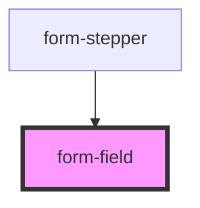

# form-field

<!-- Auto Generated Below -->

## Properties

| Property            | Attribute     | Description | Type      | Default     |
| ------------------- | ------------- | ----------- | --------- | ----------- |
| `error`             | `error`       |             | `string`  | `undefined` |
| `label`             | `label`       |             | `string`  | `undefined` |
| `maxlength`         | `maxlength`   |             | `number`  | `undefined` |
| `minlength`         | `minlength`   |             | `number`  | `undefined` |
| `name` _(required)_ | `name`        |             | `string`  | `undefined` |
| `placeholder`       | `placeholder` |             | `string`  | `undefined` |
| `required`          | `required`    |             | `boolean` | `undefined` |
| `type`              | `type`        |             | `string`  | `'text'`    |
| `value`             | `value`       |             | `string`  | `''`        |

## Events

| Event          | Description | Type                                                            |
| -------------- | ----------- | --------------------------------------------------------------- |
| `valueChanged` |             | `CustomEvent<{ name: string; value: string; valid: boolean; }>` |

## Dependencies

### Used by

 - [form-stepper](../form-stepper)

### Graph

----------------------------------------------

*Built with [StencilJS](https://stenciljs.com/)*
