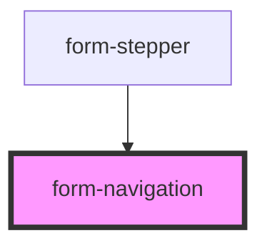

# form-navigation

<!-- Auto Generated Below -->

## Properties

| Property      | Attribute      | Description | Type         | Default     |
| ------------- | -------------- | ----------- | ------------ | ----------- |
| `currentStep` | `current-step` |             | `number`     | `undefined` |
| `disableNext` | `disable-next` |             | `boolean`    | `undefined` |
| `maxStep`     | `max-step`     |             | `number`     | `undefined` |
| `onSubmit`    | `on-submit`    |             | `() => void` | `undefined` |

## Dependencies

### Used by

 - [form-stepper](../form-stepper)

### Graph

----------------------------------------------

*Built with [StencilJS](https://stenciljs.com/)*
