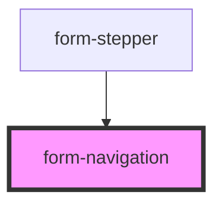

# form-navigation

<!-- Auto Generated Below -->

## Properties

| Property      | Attribute      | Description | Type      | Default     |
| ------------- | -------------- | ----------- | --------- | ----------- |
| `currentStep` | `current-step` |             | `number`  | `undefined` |
| `disableNext` | `disable-next` |             | `boolean` | `false`     |
| `totalSteps`  | `total-steps`  |             | `number`  | `undefined` |

## Events

| Event          | Description | Type                |
| -------------- | ----------- | ------------------- |
| `navigateBack` |             | `CustomEvent<void>` |
| `navigateNext` |             | `CustomEvent<void>` |

## Dependencies

### Used by

 - [form-stepper](../form-stepper)

### Graph

----------------------------------------------

*Built with [StencilJS](https://stenciljs.com/)*
