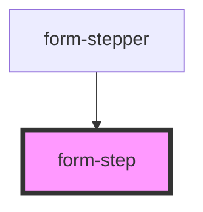

# form-step

<!-- Auto Generated Below -->

## Properties

| Property | Attribute | Description | Type     | Default     |
| -------- | --------- | ----------- | -------- | ----------- |
| `step`   | `step`    |             | `number` | `undefined` |

## Dependencies

### Used by

 - [form-stepper](../form-stepper)

### Graph

----------------------------------------------

*Built with [StencilJS](https://stenciljs.com/)*
